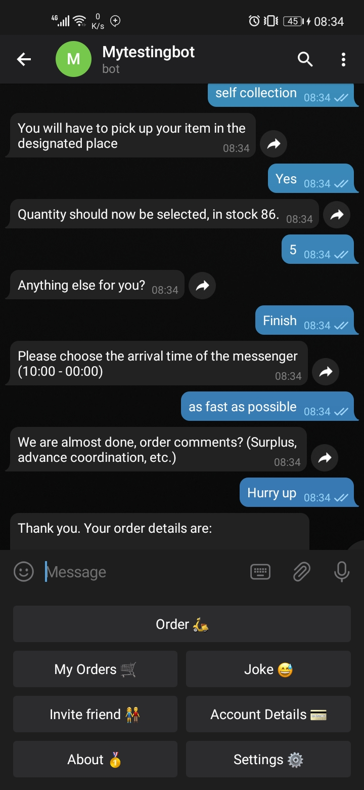

# Telegram-bot, 100% python
Telegram bot for ordering items online.
- The bot was developed as a result of curiosity of what Telegram is capable of.
- The project became detailed, and I had to stop it before it could consume me.
- I managed to host it at https://www.pythonanywhere.com/ for sometimes, but they killed it as it required premium services.
- Interested party can clone the repo and refactor the code to suit their needs.
#### Please treat it with care as it consumed almost two months of my precious time. LOL
The bot overview and main menu
- sorry for the English, The bot was meant to be used in Israel.
-
- 

- The bot got jokes too. The jokes are fetched from an API, and are randomly generated
-
- 

- And The bot can order. The order process is smooth, with capabilities to add more items to the basket. calculate total amounts and more

- 

-- More to it
- Manager side where the he or she can add items or close orders and also view orders. The manager also can manage orders and users in a private channel, where he or she can bloc and unblock users, add admins, delete orders and more
- customer side where only he or she can order and view his or her orders

# HAVE FUN WHILE REUSING THE CODE, 
